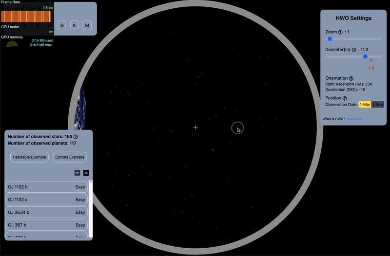
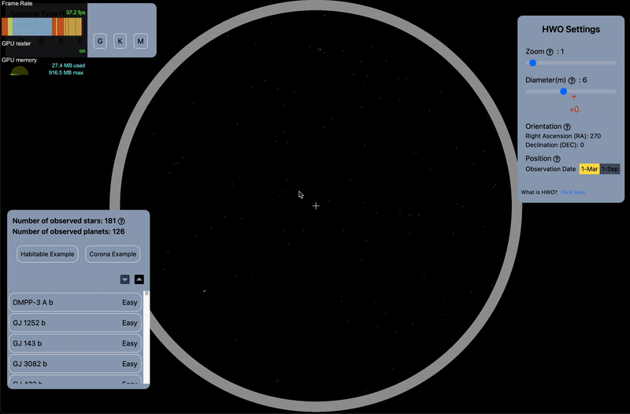
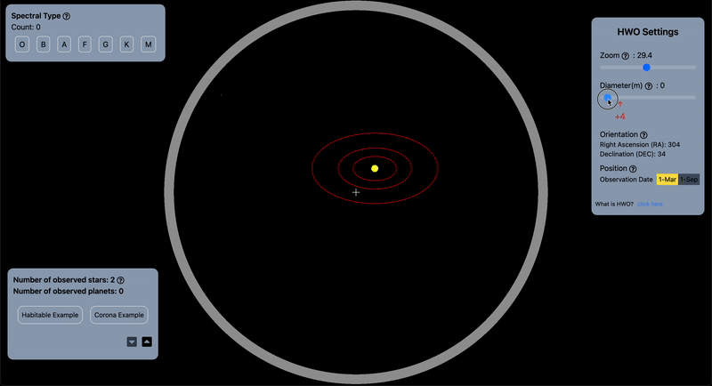
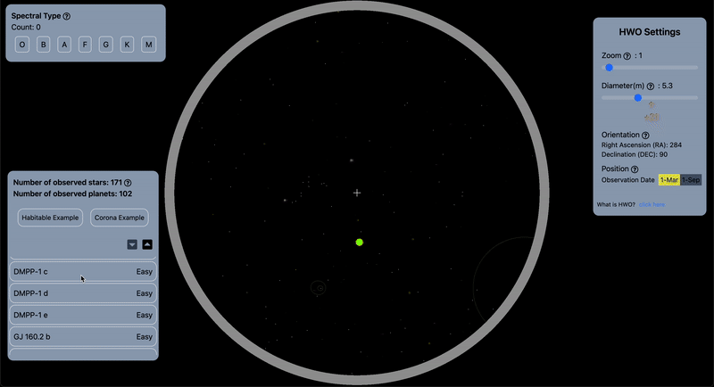

# 2024 NASA Space Apps Challenge

## Theme: Navigator for the Habitable Worlds Observatory (HWO)\_ Mapping the Characterizable Exoplanets in our Galaxy

---

## 개발에 사용한 기술

- Build/Bundler: `Vite`
- Library: `React`
- Language: `TypeScript`
- Styling: `Tailwind CSS`
- State manager: `Jotai`
- Fetching: `Axios`
- WebGL (3D): `Three`, `@react-three/fiber`, `@react-three/drei`, `gsap`
- Icons: `react-icons`
- Deploy: `gh-pages`

---

## 프로젝트 소개

### NASA의 외계 행성 데이터셋을 활용해 행성/항성의 좌표를 계산하고, HWO 망원경의 1인칭 시점을 구현

1.  `useMemo`, `React.memo`, `useCallback`을 활용해 변하지 않는 값과 컴포넌트들을 최상위 컴포넌트에서 계산 및 메모이제이션해 fps를 3~10 -> 18~42로 약 **425~500%** 개선
    | Before | After |
    | ---------------------------------------- | -------------------------------------- |
    |  |  |

2.  useFrustumCheck 커스텀 훅을 구현해 현재 화면에 보이는 행성/항성 수를 좌하단 모달에 업데이트

3.  PerspectiveCamera에 zoom state를 반영하고 updateProjectionMatrix 함수를 호출해 확대/축소 구현
    

4.  좌하단 모달에서 행성명에 커서를 올리거나, 좌상단 분광형에 커서를 올리면, 해당하는 오브젝트를 시각화
    

5.  HWO 망원경의 직경(diameter)을 변경하면, 관측 가능한 행성과 1m 키우면 관측 가능한 행성을 "초록 궤도"와 "빨간 궤도"로 시각화
    

### 외계 행성계 확대 구현

1. 좌하단 행성 중 하나를 클릭하면, 해당 행성이 속한 항성계를 시각화. 대략적인 항성과의 거리 및 공전 궤도를 반영해 구현
   

---

## 상세 구현 프로세스

1. **좌표 계산:**
   - NASA Exoplanet Archive 데이터를 활용해 별과 외계 행성을 시각화합니다.
     - RA, DEC, Distance 데이터를 사용해 외계 항성계의 좌표를 계산합니다.
     - semiMajorAxis와 eccentricity를 기반으로 외계 행성의 공전 궤도를 계산합니다.
2. **중심별 및 외계 행성 시각화:**
   - 모든 중심별은 기본적으로 시각화합니다.
   - 모든 외계 행성에 대해, SNR > 5 및 ESmax > Distance 조건을 만족하는 경우만 시각화합니다.
3. **HWO Settings 패널:**
   - 사용자가 HWO Settings에서 Diameter 값을 조절하면 실시간으로 시각화되는 행성의 수가 변경되고, 관측 가능한 행성들이 초록색 궤도로, 관측 불가능한 행성들이 빨간색 궤도로 시각화됩니다.
   - 초록색 궤도는 현재 Diameter 값으로 관측 가능한 행성을, 빨간색 궤도는 Diameter를 1m 키웠을 때 관측 가능한 행성을 의미합니다.
   - Diameter를 1m 키웠을 때 추가로 관측 가능한 외계 행성의 수를 실시간으로 계산하여, 사용자가 이를 HWO Settings 패널에서 확인할 수 있습니다.
   - Zoom 설정을 통해 시각을 확대하거나 축소할 수 있으며, 확대/축소에 따라 관측 가능한 행성의 수와 이름이 실시간으로 변경됩니다.
   - 화면을 회전할 때 RA와 DEC 값이 실시간으로 업데이트되어, 현재 HWO가 바라보고 있는 방향을 나타냅니다.
   - HWO는 제2 라그랑주 지점(L2)에 위치할 예정이므로, 3월과 9월을 기준으로 지구의 위치를 시각화하여 현실적인 HWO 망원경의 위치를 사용자에게 전달합니다.
   - "What is HWO?" 클릭 요소를 배치해 사용자가 HWO에 대해 더 알고 싶을 경우 NASA 공식 사이트로 이동할 수 있도록 돕습니다.
4. **Observed 패널:**
   - 외계 행성 이름에 마우스를 올리면 해당 행성에 강조 효과가 적용되어 시각적으로 표시됩니다.
   - 현재 HWO의 시야에 들어오는 외계 행성 및 중심별의 수를 실시간으로 계산해 보여줍니다.
   - 외계 행성 이름을 클릭하면 해당 항성계로 확대되어 더 자세한 정보를 제공합니다.

### 외계 항성계 시각화 화면

1. **중심별 및 외계 행성 시각화:**
   - 중심별과 외계 행성, 그리고 공전 궤도를 확대된 비율로 시각화하며, 행성들이 중심별을 공전하는 모습이 실시간으로 표시됩니다.
   - 선택된 행성의 공전 궤도는 노란색으로, 선택되지 않은 행성들의 궤도는 하얀색으로 표시됩니다.
2. **행성 정보 패널:**
   - 선택된 행성의 이름(planetName), 중심별 이름(hostName), 위치(RA, DEC, Distance), 요약 정보, 그리고 지구 유사도(팀원들이 계산하여 백엔드로부터 전달받은 값)를 보여줍니다.
   - 한 별에 여러 외계 행성이 있을 경우, 이전/다음 버튼을 통해 선택된 행성을 변경할 수 있습니다.
3. **HWO Settings 패널:**
   - 확대된 항성계 내에서 Direct Imaging 방식으로 관측된 외계 행성이 있을 경우, 코로나 그래프를 활성화할 수 있습니다.
   - 코로나 그래프를 활성화하면 중심별의 밝기가 억제되어 행성이 더 잘 보이게 됩니다.
   - Direct Imaging 방식이 아닌 다른 방식으로 관측된 외계 행성은 가상의 모습으로 시각화되며, 이 경우 코로나 그래프를 사용할 수 없습니다.
4. **Go back to HWO 버튼:**
   - 별과 외계 행성 시각화 페이지로 돌아가는 "Go back to HWO" 버튼을 제공합니다.

---
